 

<h1 align="center">Hi, I'm Renan! 👋</h1>

  Fullstack developer focused on fullstack and platform engineering — I build the systems
behind a real-money competitive gaming platform: esports data pipelines, wallets and
payments, matchmaking, and anti-fraud.

  
  

##  🚀 About Me

I came from over a decade in the video game industry, which turns out to be an unfair
advantage: when you're integrating Riot, Steam and Faceit APIs, or designing a challenge
like "highest KDA in the match", knowing how the games actually work matters as much as
knowing how to ship the code.

## 💡 What I work on

**Esports & game data integrations**
Match ingestion and player account linking across League of Legends, TFT, Valorant, CS2,
Dota 2, Chess.com and Clash Royale. I owned the Dota 2 integration end to end — account
sync via Steam/OpenDota, Turbo support, and the challenge/scoring layer on top of it.

**Payments & financial systems**
Wallets, ledger/accounting, Pix payouts, deposit bonuses with rollover, tiered cashback,
coupon and refund lifecycles. The kind of code where an off-by-one rounding error is a
real-money bug.

**Distributed background processing**
Event-driven jobs across specialized BullMQ workers (financial, wallets, gamemodes,
coupons, users) — match monitoring, settlement, notifications, scheduled routines.

**Experimentation & growth features**
A/B tests behind LaunchDarkly and Statsig, daily-spin and rewards mechanics, leagues,
challenge rankings, missions, and the backoffice tooling the ops team lives in.

**Anti-fraud & competitive integrity**
Detecting collusion and abuse in skill-based matches; player rating with OpenSkill and
matchmaking via graph maximum-matching.

 ## 💼 Stack

**Languages** TypeScript · JavaScript (ES6+) · SQL · HTML5 · CSS3

**Backend** Node.js · Express · Prisma · REST APIs · BullMQ · node-cron ·
Zod / Joi validation · Passport + JWT · i18next

**Data** PostgreSQL · Redis · Prisma Migrate · Firebase

**Frontend** React · React Native · Next.js · Expo · Vite ·
MUI · Tailwind CSS · Styled Components · Native Base

**Testing** Vitest · Supertest · Nock · unit + integration suites against a real database

**Observability** OpenTelemetry · Sentry · Prometheus · Winston

**Infra & tooling** Docker · GitHub Actions (CI/CD) · PM2 · AWS S3 · Git ·
ESLint + Prettier · Conventional Commits · Husky

**Integrations** Riot Games API · Steam / OpenDota / Faceit · Stripe · Pix ·
Twilio · SendGrid · Segment · Pusher · Slack · LaunchDarkly · Statsig

## 🧭 How I work

- **Design before code on anything non-trivial.** I write ADRs — problem, options,
  trade-offs, decision — so the reasoning survives longer than the pull request.
- **Tests where they earn their keep.** Financial and match-settlement paths get
  integration tests against a real database, not mocks that agree with me.
- **Small, reviewable PRs** with conventional commits and a clear changelog trail.
- **Bilingual delivery** — Portuguese (native) and English; I work across
  BR and US products and write docs in both.

## 📊 GitHub Stats

## 📫 Get in touch

- LinkedIn: <https://www.linkedin.com/in/bianchirenan/>
- Email: <renanbianchi@gmail.com>
